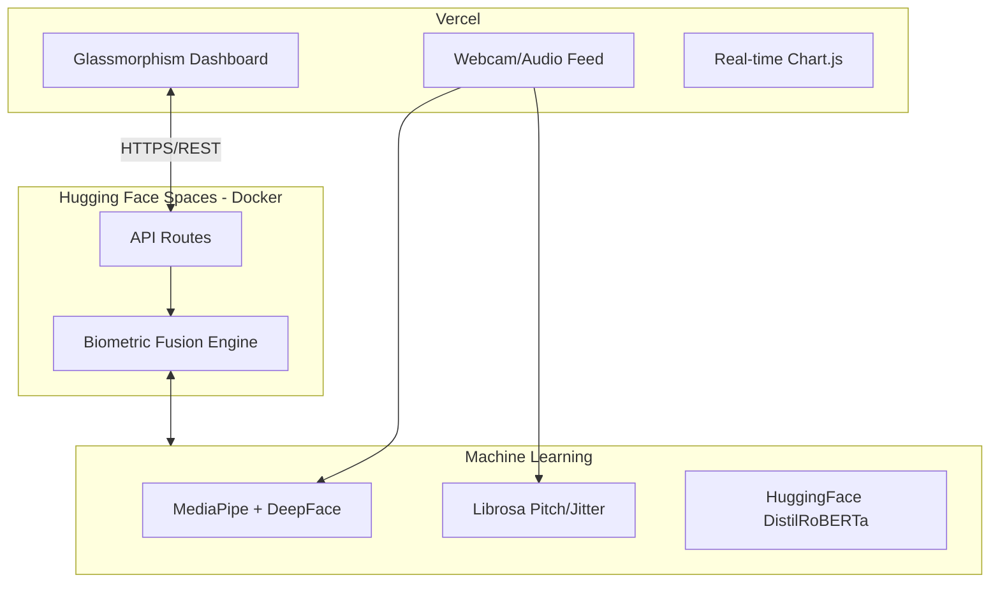

<div align="center">
  
  
  
  

  <h1>🧠 NeuroSense AI</h1>
  <h3>Cybernetic Stress Intelligence & Biometric OS</h3>
  <p>A state-of-the-art mental health monitoring system that leverages Computer Vision, Signal Processing, and Natural Language Processing to actively mitigate cognitive stress in real-time.</p>
</div>

<br/>

## 🌟 The Cybernetic Experience

NeuroSense isn't just a dashboard—it's an active entity that reacts to your biological state:

| Feature | Description |
|:---:|---|
| 💧 **Bio-Sustenance** | An intelligent hydration bar that drains twice as fast if your cognitive stress spikes. |
| 🌊 **Flow State** | Monitors your "zen" state and rewards consecutive minutes of uninterrupted deep focus. |
| 🌙 **Circadian Sync** | Automatically transitions the UI to a soothing, low-blue-light amber theme if high stress is detected after 6 PM. |
| 🛑 **Slouch Lockout** | Uses MediaPipe spinal tracking. If you slouch too long, it blurs the screen until you sit up straight! |
| 📝 **AI Journal** | Type free-form thoughts; the NLP engine logs your emotional state and gives psychological feedback. |

<br/>

## 🏗️ System Architecture



<br/>

## 🚀 How to Run Locally

### Option A: The One-Click Docker Method (Recommended)
Don't want to install Python packages? Just use Docker!
```bash
docker-compose up --build
```
🌐 Dashboard: `http://localhost:8000` | 🔌 API: `http://localhost:7860`

### Option B: The Manual Way
```bash
# 1. Install dependencies
pip install -r backend/requirements.txt

# 2. Start the API (Terminal 1)
python backend/app.py

# 3. Start the UI (Terminal 2)
python serve.py
```

<br/>

## ☁️ Free Deployment (Vercel + Hugging Face)

For a 100% free production environment with high RAM for ML models:

### 1. Backend (Hugging Face Spaces) - FREE 16GB RAM
1. Create a new **Space** on [Hugging Face](https://huggingface.co/new-space).
2. Select **Docker** as the SDK.
3. Connect your GitHub repo.
4. Hugging Face will automatically use the root `Dockerfile` and provide you with a URL like `https://user-space.hf.space`.
5. **Bonus:** HF Spaces provides 16GB of RAM for free, which is perfect for these ML models.

### 2. Frontend (Vercel) - FREE Static Hosting
1. Import your GitHub repo into [Vercel](https://vercel.com/new).
2. The `vercel.json` will automatically route traffic to the `frontend` directory.
3. Update your `frontend/app.js` with your Hugging Face Space URL.

---
<div align="center">
  <b>Built for developers who want premium AI features for $0. 💙</b>
</div>
