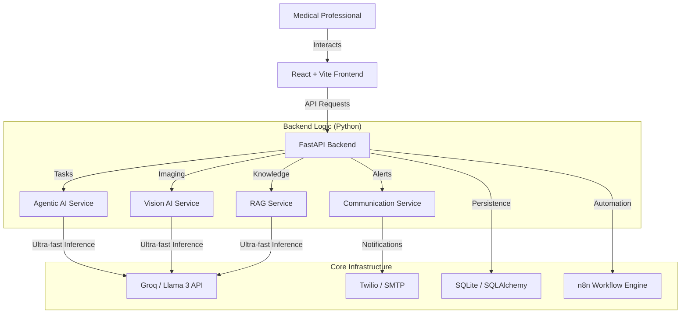

# MedAI — Next-Gen AI Medical Assistant 🏥

MedAI is a cutting-edge medical platform designed to assist healthcare professionals with AI-driven diagnostics, radiological analysis, and complex medical task automation. 

Built with a **FastAPI** backend and a **React-Vite** frontend, it leverages ultra-fast inference through **Groq** and **Llama 3** to provide near-instant medical reasoning.

---

## 🔥 Key Features

### 🧠 1. Agentic AI (Multi-Step Planning)
Unlike standard chatbots, our **Agentic AI** doesn't just respond; it **plans**. It breaks down complex medical tasks (e.g., drug interaction checks or treatment protocols) into logical steps and executes them autonomously.
*   **Tech:** Llama 3-8B (via Groq), Multi-step execution planning.

### 👁️ 2. Medical Vision AI
A dedicated pipeline for analyzing medical scans (X-Rays, MRI, CT). Our system performs image validation and preprocessing before generating structured radiology reports.
*   **Tech:** Python Imaging Library (PIL), Llama 3 (Metadata-enhanced analysis).

### 📚 3. RAG Knowledge Base
Retrieval-Augmented Generation ensures all medical advice is grounded in verified clinical databases and research papers, significantly reducing AI "hallucinations."
*   **Tech:** Context-aware prompt engineering over clinical documentation.

### 📊 4. Real-time Analytics Dashboard
A high-performance dashboard monitoring system health, AI accuracy trends, and recent clinical activity in real-time.

---

## 🏗️ System Architecture

---

## 🚀 Getting Started

### Prerequisites
- Python 3.9+
- Node.js 18+
- [Groq API Key](https://console.groq.com/)

### 🛠️ Backend Setup
1. Navigate to `/backend`
2. Install dependencies: `pip install -r requirements.txt`
3. Configure your `.env` file (Add `GROQ_API_KEY`)
4. Start the server: `uvicorn api_server:app --reload`

### 🎨 Frontend Setup
1. Navigate to `/frontend`
2. Install dependencies: `npm install`
3. Start the dev server: `npm start`

---

## 📜 Legal Disclaimer
MedAI is designed for **educational and research purposes only**. It is not intended for diagnostic use and should not replace professional medical judgment. Always consult a qualified healthcare provider.

---
**Built with ❤️ for the Modern Medical Era.**
