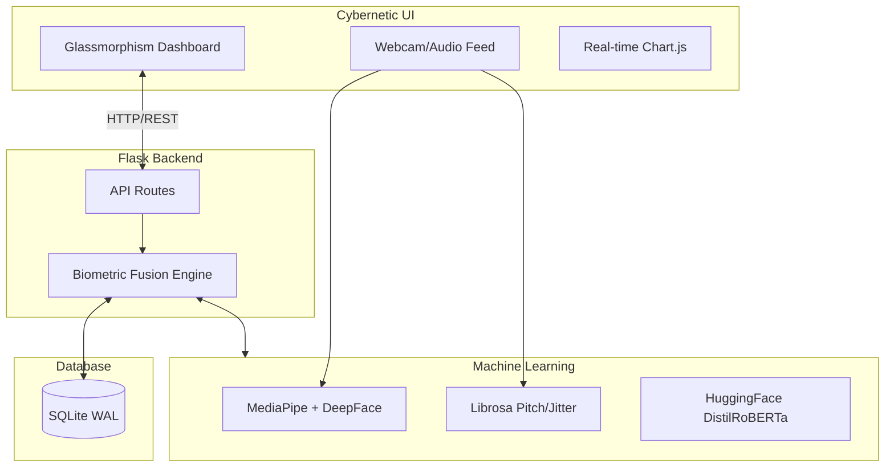

# Institute of Engineering & Technology
## Department of Computer Engineering & Application

---

# NeuroSense AI: Cybernetic Stress Intelligence & Biometric OS
### A Project Report submitted in partial fulfilment of the requirements for the award of the degree of
### Bachelor of Technology
### in Computer Science and Engineering (AIML)

**Group No.:** [Your Group Number]
**Under the Guidance of:** [Your Guide's Name]

---

## DECLARATION
We, the students of B.Tech in Computer Science and Engineering (Artificial Intelligence and Machine Learning), hereby solemnly declare that the project report entitled "NeuroSense AI: Cybernetic Stress Intelligence & Biometric OS" submitted in partial fulfillment of the requirements for the award of the degree of Bachelor of Technology, is an authentic record of our original work carried out under the valuable guidance and supervision of our project guide.

We further declare that the work presented in this report is a result of our own efforts, research, and contributions, except where explicit references have been made.

---

## CERTIFICATE
This is to certify that the project report entitled "NeuroSense AI: Cybernetic Stress Intelligence & Biometric OS" submitted by the group in partial fulfillment of the requirements for the award of the degree of Bachelor of Technology in Computer Science and Engineering (Artificial Intelligence and Machine Learning) is a bona fide record of the original work carried out by them under my supervision and guidance.

---

## ACKNOWLEDGEMENT
The successful completion of any project is never the work of a single individual. It is the culmination of collective effort, guidance, and support from many quarters. We take this opportunity to express our profound gratitude to all those who have contributed directly or indirectly to the successful execution of this project, especially our guide and the Head of Department.

---

## ABSTRACT
Mental stress and poor ergonomics are growing concerns in the digital age. NeuroSense AI is a state-of-the-art mental health monitoring system that leverages Computer Vision, Signal Processing, and Natural Language Processing to actively mitigate cognitive stress in real-time. Unlike traditional passive tracking dashboards, NeuroSense is an active cybernetic entity that reacts to a user's biological state. It employs a "Sensor Fusion" approach combining visual/kinematic pipelines, acoustic pipelines, and linguistic pipelines. The system features active interventions such as a Bio-Sustenance hydration bar, Flow State monitoring, Circadian Syncing for UI adjustments, Ergonomic Slouch Lockout, and an AI Journal. The system architecture utilizes a Flask backend, a highly concurrent SQLite WAL database, and a Glassmorphism frontend dashboard, all containerized via Docker for seamless deployment on Microsoft Azure.

**Keywords:** Affective Computing, Computer Vision, Natural Language Processing, Signal Processing, Biometric OS, MediaPipe.

---

## Contents
1. Synopsis
2. Technical Keywords
3. Introduction
4. Problem Definition and Scope
5. Project Plan
6. Software Requirement Specification
7. Detailed Design Document
8. Project Implementation
9. Software Testing
10. Results and Discussion
11. Deployment and Maintenance
12. Conclusion and Future Scope
13. References

---

## Chapter 1: Synopsis
NeuroSense AI addresses the modern challenge of prolonged cognitive stress and poor ergonomics by creating a Cybernetic Stress Intelligence ecosystem. By actively analyzing a user's facial micro-expressions, posture, vocal strain, and typed thoughts, it forms a comprehensive view of their mental and physical state. When adverse states (e.g., slouching, high stress, fatigue) are detected, it intervenes autonomously through UI adaptations like screen blurring, theme switching, and real-time biometric feedback.

## Chapter 2: Technical Keywords
- **Deep Learning & NLP**: HuggingFace Transformers (DistilRoBERTa-base), DeepFace (VGG-Face)
- **Computer Vision**: MediaPipe (Face Mesh/Pose), OpenCV
- **Signal Processing**: Librosa (MFCCs, Pitch Variance)
- **Backend & DB**: Python, Flask, SQLite WAL
- **Deployment**: Docker, Docker Compose, Microsoft Azure Container Apps

## Chapter 3: Introduction
### 3.1 Project Idea
NeuroSense isn't just a dashboard—it's an active entity. It transforms traditional mental health applications from passive "trackers" into active "interveners."

### 3.2 Motivation
Prolonged screen time leads to poor posture, diminished focus, and heightened stress. Users often forget to drink water or take breaks. The motivation is to create an OS-level layer that cares for the user's biology automatically.

### 3.3 Literature Survey
Existing solutions rely heavily on manual inputs or focus entirely on a single modality (e.g., only posture or only screen time). Affective computing research shows that "Sensor Fusion"—combining visual, acoustic, and linguistic data—yields much higher accuracy in determining true cognitive load.

## Chapter 4: Problem Definition and Scope
### 4.1 Problem Statement
To build an automated, real-time stress intelligence system that accurately measures and proactively reduces user stress and physical strain.
### 4.2 Statement of Scope
The system will run locally or in the cloud. It interfaces with the user's webcam, microphone, and keyboard to analyze data locally or via a secure API. 
### 4.3 Major Constraints
- Real-time processing requires efficient model inference.
- Ensuring privacy and secure handling of biometric data.

## Chapter 5: Project Plan
### 5.1 Project Model Analysis
We utilize the Spiral Methodology, iterating through prototypes of individual ML pipelines before fusing them in the final backend.
### 5.2 Risk Management
- **Risk 1:** High latency in AI processing leading to UI freeze. (Mitigated via asynchronous backend workers).
- **Risk 2:** False positives in slouch detection. (Mitigated by requiring >15 seconds of sustained slouching).

## Chapter 6: Software Requirement Specification
### 6.1 Functional Requirements
- System must analyze facial expressions to detect drowsiness/stress.
- System must analyze voice and text for cognitive load.
- System must visually lock out the user if slouching is detected.
### 6.2 Non-Functional Requirements
- **Performance:** End-to-end processing time per frame under 200ms.
- **Reliability:** SQLite WAL to handle concurrent read/writes without locking.

## Chapter 7: Detailed Design Document
### 7.1 System Architecture


### 7.2 Modules
- **Visual & Kinematic Pipeline:** Tracks EAR (Eye Aspect Ratio), Gaze, and Spinal Alignment.
- **Acoustic Pipeline:** Extracts MFCCs to detect vocal strain.
- **Linguistic Pipeline:** Analyzes journal entries for emotional bandwidth.
- **Autonomous Intervention Layer:** Bio-Sustenance (hydration), Flow State, Circadian Syncing, and Ergonomic Lockout.

## Chapter 8: Project Implementation
### 8.1 Tools and Technologies Used
- **Languages:** Python 3.10+, JavaScript/HTML/CSS
- **Frameworks:** Flask, Docker
- **Cloud:** Azure Container Apps
### 8.2 Algorithm Details
- **Fusion Logic:** A weighted aggregation engine ensuring no single modality triggers a false positive.
- **NLP:** DistilRoBERTa-base calculates a negative/positive sentiment probability threshold.
- **Vision:** MediaPipe holistic nodes are mapped to ergonomic angles.

## Chapter 9: Software Testing
### 9.1 Type of Testing
- Integration Testing between the ML models and Flask backend.
- Performance Testing to ensure real-time UI updates without freezing.
### 9.2 Test Cases
| Case | Description | Expected Result | Status |
|---|---|---|---|
| 1 | Slouch for > 15 seconds | UI triggers screen blur | Pass |
| 2 | Post journal entry with stressed text | High cognitive load detected | Pass |
| 3 | Work without interruptions | Flow State activated | Pass |

## Chapter 10: Results and Discussion
The system successfully intervenes by dimming screens and shifting to a low-blue-light "Zen Theme" after 6 PM if stress is high. The Bio-Sustenance bar accurately depletes faster under high cognitive load, prompting the user to hydrate.

## Chapter 11: Deployment and Maintenance
### 11.1 Deployment Instructions
**Option A: Docker**
```bash
docker-compose up --build
```
Dashboard available at `http://localhost:8000`, API at `http://localhost:5001`.

**Option B: Azure Deployment**
Run the automated deployment script:
```bash
bash deploy_azure.sh
```

## Chapter 12: Conclusion and Future Scope
### 12.1 Conclusion
NeuroSense AI successfully bridges the gap between passive health monitoring and active cybernetic intervention. It establishes a responsive ecosystem that genuinely adapts to the user's physiological needs.
### 12.2 Future Scope
- Integration with smartwatches for continuous heart rate and HRV monitoring.
- Desktop native application (Electron) to enforce system-wide screen locks.

---
*Generated by AI based on Project Source Files.*
